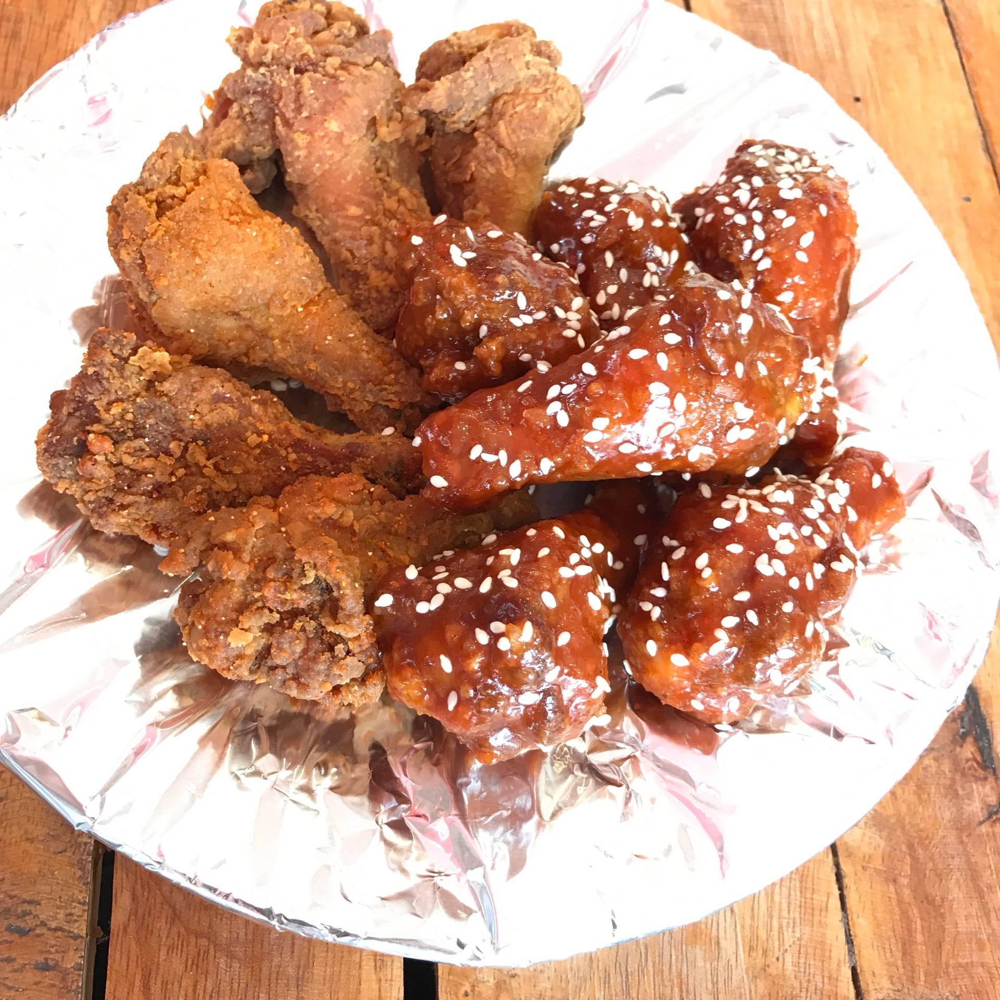

Visiting KKU for the first time? This guide will give you mouthwatering choices around KKU through the experiences of the locals.

## Quick Links
* [Must Try](#musttry)
* [Cafe](#cafe)
* [Street Foods](#street)
* [Authentic E-SAN Foods](#esan)
* [Fine Dining and Restaurants](#finedin)
* [Public Events](#event)
* [Grab and Go](#grab)

---
## Must Try!! :rice: :ramen:
Something you can not miss when visiting KKU

#### 1. ขนมโตเกียว หน้าคณะวิทยาการจัดการ

*อ้างอิงข้อมูลและภาพจาก:* [KAD.IN.TH](https://kad.in.th/shop/%E0%B8%A3%E0%B9%89%E0%B8%B2%E0%B8%99%E0%B8%82%E0%B8%99%E0%B8%A1%E0%B9%82%E0%B8%95%E0%B9%80%E0%B8%81%E0%B8%B5%E0%B8%A2%E0%B8%A7-%E0%B8%A1%E0%B8%82-%E0%B8%AB%E0%B8%99%E0%B9%89%E0%B8%B2%E0%B8%84/)

> ขายดีจนต้องขยายสาขา มีหลากหลายไส้ให้เลือก ราคาย่อมเยาว์
> เวลาเปิด-ปิด: 9:00-18:00 น.
> พิกัด: ศูนย์บริการอาหาร 4 ใต้ที่จอดรถคณะวิทยาการจัดการ